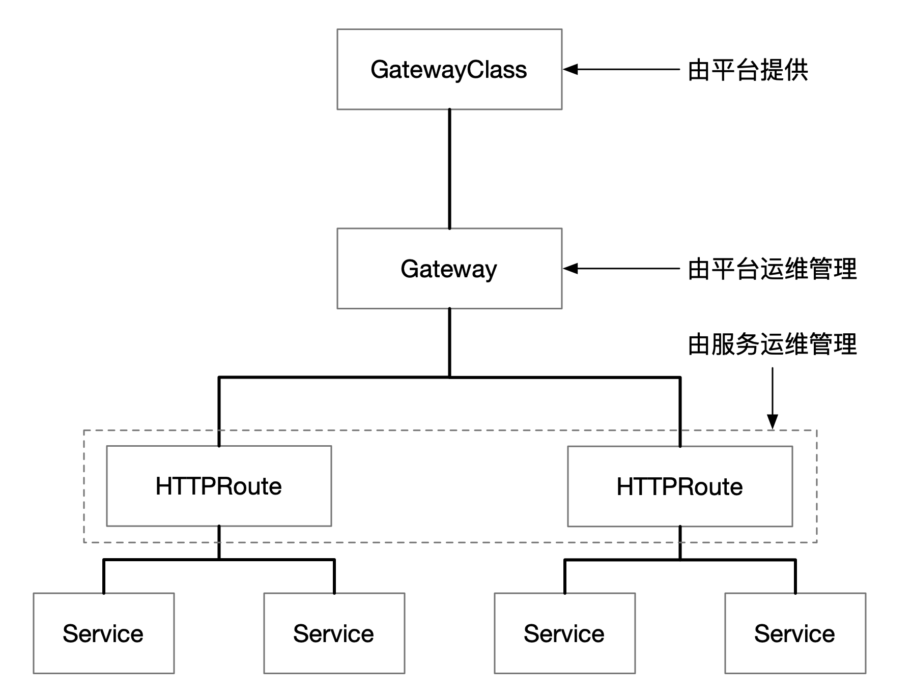

# Kubernetes Service API

除了直接使用 Service 和 Ingress 之外，Kubernetes 社区还发起了 Service API 项目，这是一个 CRD，可以帮助我们将 Kubernetes 中的服务暴露到集群外。

Service API 是一个由 [SIG-NETWORK](https://github.com/kubernetes/community/tree/master/sig-network) 管理的开源项目。该项目的目标是在 Kubernetes 生态系统中发展服务网络 API。Service API 提供了暴露 Kubernetes 应用的接口 ——Service、Ingress 等。你可以在 [Service API 的官网](https://kubernetes-sigs.github.io/service-apis/) 了解更多。

该 API 在 [Istio](https://kubernetes-sigs.github.io/service-apis/) 中也被应用，用于将 Kubernetes 中的服务暴露到服务网格之外。

## 目标

Service API 旨在通过提供表现性的、可扩展的、面向角色的接口来改善服务网络，这些接口由许多厂商实现，并得到了业界的广泛支持。

Service API 是一个 API 资源的集合 —— 服务、GatewayClass、Gateway、HTTPRoute、TCPRoute 等。使用这些资源共同为各种网络用例建模。

下图中展示的是 Kubernetes 集群中四层和七层的网络配置。从图中可以看到通过将这些资源对象分离，可以实现配置上的解耦，由不同角色的人员来管理。

## Service API 相较于 Ingress 做了哪些改进？

**更具表现力**

Service API 表达了更多的核心功能，比如基于头的匹配、流量加权和其他功能，而这些功能在 Ingress 中只能通过自定义方式实现。

**更具扩展性**

Service API 允许在 API 的各个层次上链接自定义资源。这就允许在 API 结构的适当位置进行更精细的定制。

**面向角色**

它们被分离成不同的 API 资源，这些资源映射到 Kubernetes 上运行应用程序的常见角色。

**通用性**

这不是一种改进，而是应该保持不变。正如 Ingress 是一个具有众多实现的通用规范一样，Service API 被设计成一个由许多实现支持的可移植规范。

**共享网关**

它们允许独立的路由资源绑定到同一个网关，从而实现负载均衡器和 VIP 的共享。这允许团队安全地共享基础设施，而不需要直接协调。

**类型化后端引用**

通过类型化后端引用，Routes 可以引用 Kubernetes 服务，也可以引用任何一种被设计为 Gateway 后端的 Kubernetes 资源。

**跨命名空间引用**

跨越不同 Namespaces 的路由可以绑定到网关。这样，尽管对工作负载进行了命名空间划分，但仍可共享网络基础设施。

**类**

`GatewayClasses` 将负载均衡实现的类型形式化。这些类使用户可以很容易和明确地了解资源模型本身有什么样的能力。

## 参考

- [Kubernetes Service APIs - kubernetes-sigs.github.io](https://kubernetes-sigs.github.io/service-apis/)

